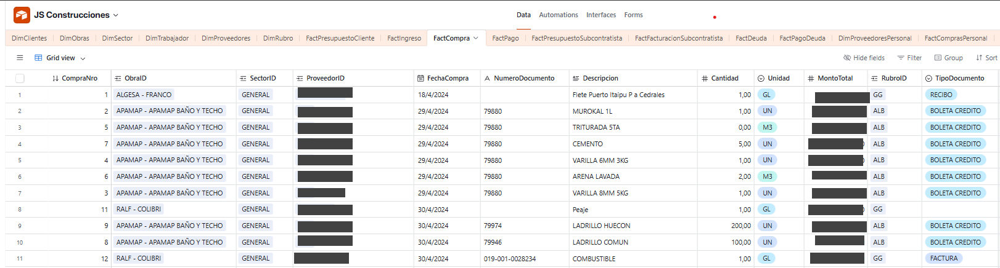
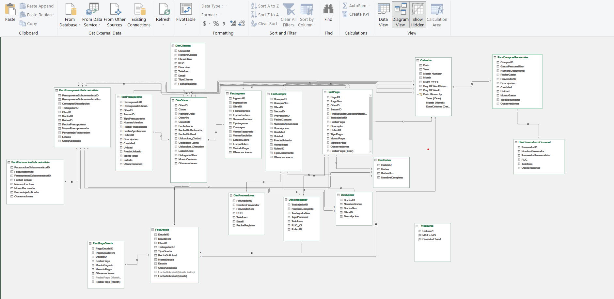
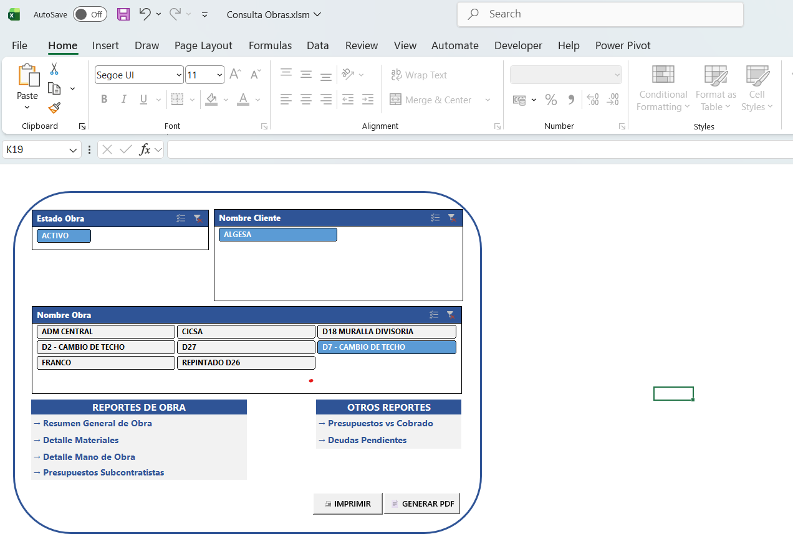
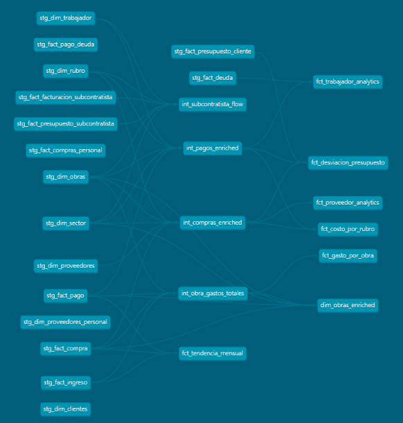
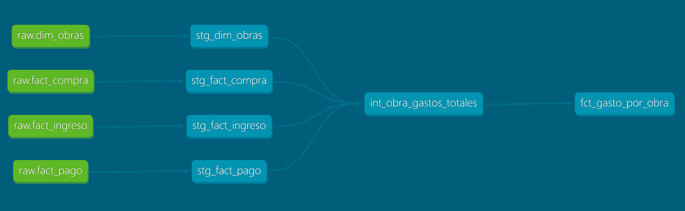

# JS Construcciones Data Architecture

End-to-end data architecture for a construction company: from chaotic Excel files to a clean dimensional model with Airtable + Excel reporting system. Report time dropped from 60 minutes to under 2.


*One of the company's construction projects in progress*

## The Problem

When I joined the company, the first thing I noticed was that they didn't even have all the data loaded in the first place. The format of their Excel files was also too messy to actually use for reporting or getting any real insights. Obviously, there were no dimension tables, no mapping tables, nothing like that.


**Initial state:**
- 42 separate Excel files (one per construction project)
- Each file contained multiple sheets tracking different data types
- Project sizes varied from small (few rows) to large (300-1,000 rows per file)
- 6,800+ total records scattered across files
- 743 providers with significant duplication and inconsistent naming
- No centralized database or single source of truth

It was daily madness loading and managing the data. Without proper dimensions and with files scattered everywhere, it was really hard to keep track of anything. And you couldn't just change everything overnight - my coworkers were only familiar with Excel, and it was the best way they knew to query and manage the data.

Reports were the other main problem. Since names, categories, and other fields weren't normalized, it required some 'manual' cleanup every time you needed to generate a report - you couldn't really automate it. It was a massive waste of time.

## Why This Matters

- The architects needed accurate, fast reports on project status - materials, total spent, by category, by worker, etc.
- Since all purchases came with physical invoices, data entry had to be fast and error-free, with a reliable method to keep things under control.
- Managing worker advances and debts, plus subcontractor budgets, had to be streamlined for quick payments and tracking progress and certificates.

**Time sink identified:**
- Report generation: 30-60 minutes per request (manual pivot tables each time)
- No way to quickly answer questions like "how much cement did we buy across all projects?"
- Error-prone data entry with no validation

## My Approach

To kick off the project, the first thing I had to do was normalize all the data columns we had. Mostly purchase data and worker payments.

For this I used a Python script to normalize everything, and from there I could create the different dimension tables and the missing fact tables to get a full picture of the company's operations.

### 1. Discovery & Assessment

I used Power Query to append all similar tables into single consolidated tables - this reduced a lot of noise. Then I ran the Python fuzzy matching script to clean up the columns I cared about: provider names, category labels (rubros), worker names, etc.

With the similar values identified, I created a mapping table and manually reviewed each match one by one to make sure the changes were 100% reliable before migration. Once the values were clean, I could move on to choosing the app for data entry and migrating everything there.

**Data scope analyzed:**
- 42 construction projects
- Date range: July 2024 - January 2026 (18 months of operations)
- Record types: purchases, payments, income, budgets, labor costs, loans

### 2. Architecture Decisions

I had to implement a complete process from data collection all the way to reports and summaries. Considering my coworkers' experience level (very basic Excel knowledge), I needed to build something so simple that practically anyone could do it - even after I leave the company. Someone with zero knowledge of databases or table types should still be able to load and update data without issues.

I also knew I couldn't take Excel out of the equation. It's widely used and practically everyone knows it, at least at a basic level. But Excel has problems with data validation and it's not very visual or intuitive when it comes to data entry. So I had to add something else to the equation. On the other hand, Excel is incredibly powerful for pivot tables - I didn't find another tool that could match it. That's another reason I kept Excel in the stack.

Power BI was also on the table. The architecture fully supports it - Airtable's API connects to Power BI the same way it connects to Power Query. But for a team of 3 people where the boss preferred printed reports over interactive dashboards, it didn't make sense to add another tool. The infrastructure is ready if that need ever changes.

I considered Google Sheets, but it lacks the relational database features. A full SQL database would've been overkill and my coworkers wouldn't be able to use it directly. SAP or a custom-built system would've been far more expensive without much immediate impact - especially considering the business scale: we're talking about roughly 100 new rows of data per day, not enterprise-level volume.

That's why, after some research, I decided on Airtable. It handles databases really well, you can configure permissions and credentials for coworkers, and it has a great API that integrates with practically anything. Visually it's very comfortable to use and has solid configuration options like automations and more.


*Airtable - data view for FactCompra (data redacted)*


**Final architecture decision:** Hybrid system
| Layer | Tool | Reasoning |
|-------|------|-----------|
| Operational Database | Airtable | Strong validation, user-friendly interface |
| ETL & Data Cleaning | Python | Python is Python|
| Reporting & Analysis | Excel + Power Query | Easy to use, powerful, and everyone knows it |
| User Interface | Excel + VBA | Familiar to users, runs on any computer |

### 3. Data Model Design

I structured the data using dimensional modeling with a star schema. This approach keeps things simple: fact tables store the transactions, dimension tables provide the context.

One key design decision was separating DimProveedores from DimProveedoresPersonal. The owner's personal expenses flow through the same system but need to stay separate from company finances. Same logic, different scope. This also made the provider deduplication cleaner - each dimension has its own clean master list.

Each fact table has a clearly defined grain: one row in FactCompra is one purchase, one row in FactPago is one payment to a worker, one row in FactDeuda is one debt record. This keeps the model predictable and easy to query.

**Dimensional model implemented:**

| Fact Tables | Description |
|-------------|-------------|
| FactCompra | Material purchases across all projects |
| FactPago | Payments to workers and contractors |
| FactIngreso | Client payments and project income |
| FactPresupuestoCliente | Client budgets and quotes |
| FactPresupuestoSubcontratista | Subcontractor budget tracking |
| FactFacturacionSubcontratista | Subcontractor invoicing and certificates |
| FactDeuda | Worker debts and advances |
| FactPagoDeuda | Debt payment tracking |
| FactComprasPersonal | Boss personal expense purchases |


| Dimension Tables | Records | Description |
|------------------|---------|-------------|
| DimProveedores | 336 | Company suppliers (materials, services) |
| DimProveedoresPersonal | 270 | Personal expense vendors (boss accounts) |
| DimObras | 45 | Construction projects (active and historical) |
| DimClientes | 9 | Company clients |
| DimTrabajador | 112 | Workers and contractors |
| DimRubro | 39 | Expense categories (Rubros) |
| DimSector | 54 | Project sectors/areas |


*Power Pivot Diagram View*


### 4. The Migration

The heaviest lift was the data cleaning and normalization, not the migration itself. Once the fuzzy matching script cleaned up the duplicates and inconsistencies, the actual migration was straightforward: export to CSV, import into Airtable, set up the relationships.

Before importing, I had to standardize column names across all 42 Excel files - each one had slight variations in how things were labeled. The Python script handled the normalization: consistent date formats, trimmed whitespace, uppercase/lowercase standardization, and mapping old category names to the new DimRubro structure.

No data was discarded. Everything that existed in the old files made it into the new system - just cleaned and properly structured.

**Deduplication challenge:**

```python
import pandas as pd
from rapidfuzz import fuzz

def normalize(text: str) -> str:
    """Normalize text for comparison: uppercase and trim whitespace."""
    return str(text).upper().strip()

def find_duplicates(df: pd.DataFrame, column: str, threshold: int = 80) -> pd.DataFrame:
    """
    Find potential duplicates in a DataFrame column using fuzzy matching.
    
    Args:
        df: DataFrame containing the data
        column: Name of the column to check for duplicates
        threshold: Minimum similarity percentage (0-100) to consider as duplicate
    
    Returns:
        DataFrame with potential duplicate pairs and their similarity scores
    """
    # Get unique values
    values = df[column].dropna().unique().tolist()
    
    duplicates = []
    
    for i, val1 in enumerate(values):
        for val2 in values[i+1:]:
            score = fuzz.ratio(normalize(val1), normalize(val2))
            if score >= threshold:
                duplicates.append({
                    'Value1': val1,
                    'Value2': val2,
                    'Similarity': score
                })
    
    df_duplicates = pd.DataFrame(duplicates)
    
    if not df_duplicates.empty:
        df_duplicates = df_duplicates.sort_values('Similarity', ascending=False)
    
    return df_duplicates

def main():
    # Configuration
    INPUT_FILE = 'DimProveedores.csv'
    COLUMN_NAME = 'NombreProveedor'
    OUTPUT_FILE = 'potential_duplicates.csv'
    THRESHOLD = 80  # Minimum similarity percentage
    
    # Load data
    print(f"Loading data from {INPUT_FILE}...")
    df = pd.read_csv(INPUT_FILE)
    print(f"Total records: {len(df)}")
    
    # Find duplicates
    print(f"\nSearching for duplicates (threshold: {THRESHOLD}%)...")
    df_duplicates = find_duplicates(df, COLUMN_NAME, THRESHOLD)
    
    # Display results
    print(f"\nPotential duplicates found: {len(df_duplicates)}")
    
    if not df_duplicates.empty:
        print("\nTop matches:")
        print(df_duplicates.head(20).to_string(index=False))
        
        # Save to CSV for manual review
        df_duplicates.to_csv(OUTPUT_FILE, index=False)
        print(f"\nFull results saved to: {OUTPUT_FILE}")
    else:
        print("No duplicates found above threshold.")

if __name__ == "__main__":
    main()
```

**Data cleaning results:**

| Metric | Before | After | Reduction |
|--------|--------|-------|-----------|
| Provider records (Company) | 743 | 336 | 55% |
| Provider records (Personal) | 561 | 270 | 51% |
| Duplicate detection method | - | Fuzzy matching (rapidfuzz) | - |
| Total records migrated | 6,800+ | 6,800+ | Cleaned & normalized |

### 5. Implementation Challenges

This project significantly improved the administrative side and decision-making processes. But to achieve 100% effective and lasting solutions, some non-data processes need adjustment first - things like how materials are purchased, how payments are made, internal standards to follow, and documentation practices.

> The architecture I designed supports capabilities beyond what was implemented in the initial release. Some features remain available for future activation when the organization's processes mature to support them.

**Implemented in v1.0:**
- ✅ Centralized purchase and payment tracking
- ✅ Project expense reports (Materials + Labor by category)
- ✅ Detailed material reports (quantities, costs, hierarchical by Rubros)
- ✅ Labor cost tracking (per worker, payment dates, granular detail)
- ✅ Loan and advance control (employee debts and payments)
- ✅ Budget tracking per project
- ✅ Income control (amounts collected per project)
- ✅ Subcontractor budget management
- ✅ One-click PDF export for all reports

**Designed but pending organizational adoption:**
- ⏳ Granular budget items with unit prices and measurements
- ⏳ Integration with architectural plans and designs
- ⏳ Material estimation per project (predictive purchasing)
- ⏳ Purchase management system linked to FactCompra
- ⏳ Simple inventory control per project site
- ⏳ Separation of personal and company accounts
- ⏳ Bank reconciliation capabilities
- ⏳ Credit and debt management with payment scheduling
- ⏳ Cash flow visibility and available balance calculation

I think in real-world business, even when solutions are right in front of you, it's not just about doing it and moving on. It involves a whole adaptation process - both in knowledge and habits - across the entire organization (management and workers). And I believe that without a goal, some self-criticism, and a genuine desire to improve day by day, you don't move forward no matter how many answers you have.

## Results

**Quantitative improvements:**

| Metric | Before | After | Improvement |
|--------|--------|-------|-------------|
| Report generation time | 30-60 min | 1-2 min | ~97% reduction |
| Data sources | 42 files | 1 database | Centralized |
| Provider duplicates | 743 | 336 + 270 | ~55% reduction |
| Data entry errors | Manual validation | Airtable constraints | Significantly reduced |

**Qualitative improvements:**
- Fast reports and queryable information at any time
- Absolute reliability in the data
- Centralized database
- Anyone with basic knowledge, even without Excel skills, can make 2 clicks and have reports in under a minute


*Labor payments report: Project → Sector → Category → Worker (data redacted)*

<br>
<br>


*One-click reporting interface with VBA automation*

## Architecture Overview

```
┌─────────────────────────────────────────────────────────────────┐
│                     LEGACY STATE (Before)                       │
│  ┌──────────┐ ┌──────────┐ ┌──────────┐        ┌──────────┐     │
│  │ Obra_01  │ │ Obra_02  │ │ Obra_03  │  ...   │ Obra_42  │     │
│  │  .xlsx   │ │  .xlsx   │ │  .xlsx   │        │  .xlsx   │     │
│  └──────────┘ └──────────┘ └──────────┘        └──────────┘     │
│       │            │            │                   │           │
│       └────────────┴─────┬──────┴───────────────────┘           │
│                          │                                      │
│                    Manual work                                  │
│              (pivot tables every time)                          │
└─────────────────────────────────────────────────────────────────┘
                           │
                           │ Migration
                           ▼
┌─────────────────────────────────────────────────────────────────┐
│                     CURRENT STATE (After)                       │
│                                                                 │
│  ┌─────────────────────────────────────────────────────────┐    │
│  │                    Python ETL Layer                     │    │
│  │           (pandas, rapidfuzz for deduplication)         │    │
│  └─────────────────────────┬───────────────────────────────┘    │
│                            │                                    │
│                            ▼                                    │
│  ┌─────────────────────────────────────────────────────────┐    │
│  │                   Airtable Database                     │    │
│  │  ┌─────────────┐ ┌─────────────┐ ┌─────────────┐        │    │
│  │  │FactCompra   │ │FactPago     │ │FactIngreso  │  ...   │    │
│  │  └─────────────┘ └─────────────┘ └─────────────┘        │    │
│  │  ┌─────────────┐ ┌─────────────┐ ┌─────────────┐        │    │
│  │  │DimProveed.  │ │DimObras  │ │DimClientes  │  ...      │    │
│  │  └─────────────┘ └─────────────┘ └─────────────┘        │    │
│  └─────────────────────────┬───────────────────────────────┘    │
│                            │                                    │
│                       Airtable API                              │
│                            │                                    │
│                            ▼                                    │
│  ┌─────────────────────────────────────────────────────────┐    │
│  │              Excel + Power Query Layer                  │    │
│  │            (Live connection, auto-refresh)              │    │
│  └─────────────────────────┬───────────────────────────────┘    │
│                            │                                    │
│                            ▼                                    │
│  ┌─────────────────────────────────────────────────────────┐    │
│  │                  Reporting Interface                    │    │
│  │     Excel workbooks + VBA macros + PDF export           │    │
│  │                                                         │    │
│  │  • Project Reports (Materials + Labor by Rubro)         │    │
│  │  • Material Detail (quantities, costs, hierarchical)    │    │
│  │  • Labor Detail (per worker, dates, payments)           │    │
│  │  • Loan Control (advances, employee debts)              │    │
│  │  • Budget Tracking (income, subcontractors)             │    │
│  └─────────────────────────────────────────────────────────┘    │
│                                                                 │
└─────────────────────────────────────────────────────────────────┘
```

## Tech Stack

| Layer | Technology | Purpose |
|-------|------------|---------|
| Database | Airtable | Operational data storage, data entry UI, validation |
| ETL | Python (pandas, rapidfuzz) | Data cleaning, deduplication, migration scripts |
| Data Connection | Power Query (M language) | Live API connection to Airtable, transformations |
| Reporting | Excel | Pivot tables, slicers, formatted reports |
| Automation | VBA | One-click PDF export, print macros, UI buttons |
| Version Control | Git | Script versioning and documentation |

## What I Learned

This project really made me realize that designing or creating something isn't easy. Once you start, between the problems that come up and the things you have to redo, you also have to keep in mind the real-world use of everything you're building.

- I was surprised to discover that nothing really compares to Excel, especially when it comes to reports and pivot tables. Really top-tier stuff.

- Next time I do a similar project, I'll definitely take one or two days to properly map out the entire flow from start to finish - whether on paper or whatever works. Because if you don't have exactly defined what you need to do, ambiguity eats up a ton of your time. Also, next time I'm evaluating apps to implement something, I'll definitely need a summary of their documentation to know exactly what they can and can't do.

- It was also really interesting working with input from my coworkers. For example, when I asked them what color they wanted or how they thought something would be easier or more intuitive, I found all their perspectives fascinating - things I hadn't considered at all when building the model logic or the reports. It really opens your mind and helps you not be so rigid.

- Next time I'll definitely do shadowing (observing a professional at work to learn about their role and responsibilities, being their "shadow" temporarily) to put myself in their shoes and understand exactly how I could help with their daily problem flow. There's no point in "thinking about how you'd like the workflow to be" while completely ignoring how people actually work and handle their day-to-day.

## Future Possibilities

These are some features that could be easily implemented with the structure already in place.


1. **Material Estimation System** - Connect budget items with historical purchase data to predict material needs per project
2. **Inventory Management** - Track stock levels at each construction site
3. **Financial Control Module** - Bank reconciliation, credit management, cash flow visibility
4. **Web Application** - React + Supabase frontend for high-volume data entry
5. **Power BI Dashboards** - Infrastructure already supports it; just needs organizational buy-in

## Project Timeline

| Phase | Duration | Activities |
|-------|----------|------------|
| Discovery & Design | 3 days | Data audit, architecture decisions, model design |
| Development & Migration | 13 days | Python scripts, Airtable setup, data migration |
| Testing & Refinement | 5 days | Report building, VBA automation, user testing |
| **Total** | **21 days** | Including learning new tools (estimated 2-3 days if repeated) |

---

## Repository Structure

```
js-construcciones-data-architecture/
│
├── README.md
├── Photos/
│   └── (your images)
│
├── docs/
│   ├── data-model.md
│   ├── data-dictionary.md
│   ├── scripts/
│   │   └── fuzzy_matching.py
│   ├── queries/
│   │   └── airtable_connection.m
│   └── samples/
│       └── schema_example.json
```

---

## Contact

Elias Figueroa
- LinkedIn: [linkedin.com/in/elias-figueroa-a143533a3](https://www.linkedin.com/in/elias-figueroa-a143533a3)
- Email: eliasfigueroa52@gmail.com

---

*This project was completed as part of my data analyst portfolio. It demonstrates end-to-end data architecture: from messy legacy systems to a clean, maintainable, and scalable solution.*

---

## v2.0 - Analytics Layer (dbt + DuckDB)

Building on top of v1.0 (production), v2.0 adds an analytical warehouse using **dbt + DuckDB** — zero infrastructure, fully reproducible, and designed to showcase SQL and data modeling skills.

### v2.0 Architecture

```
Airtable (production)
    │
    ▼
Python Extract (pyairtable)
    │
    ▼
DuckDB (raw schema) ──► dbt (staging → intermediate → marts)
    │                                        │
    ▼                                        ▼
Analytics                            dbt tests + docs
├── SQL Queries (showcase)
└── Jupyter EDA (insights)
```

### What v2.0 Adds

| Component | Details |
|-----------|---------|
| **Warehouse** | DuckDB (local, zero-config) |
| **Transformations** | dbt-core with 27 SQL models |
| **Staging** | 16 models — type casting, snake_case, TRIM+UPPER on FKs |
| **Intermediate** | 4 enriched models — joins across fact + dimension tables |
| **Marts** | 7 analytical models — Pareto, trends, budget deviation, rankings |
| **Data Quality** | dbt tests (unique, not_null, relationships, accepted_values) + 3 custom tests |
| **Analytics** | 5 showcase SQL queries + Jupyter EDA notebook |

### v2.0 dbt Models

**Staging (views):** 16 models mapping raw Airtable extracts to clean, typed, snake_case tables.

**Intermediate (views):**
- `int_compras_enriched` — purchases + obra + proveedor + rubro + sector
- `int_pagos_enriched` — payments + obra + trabajador + rubro + sector
- `int_subcontratista_flow` — budget → invoicing → payments with pending balance
- `int_obra_gastos_totales` — materials + labor + income aggregated per obra

**Marts (tables):**
- `fct_gasto_por_obra` — financial summary per project with ranking
- `fct_costo_por_rubro` — cost breakdown by category within each project
- `fct_proveedor_analytics` — supplier Pareto (80/20) analysis
- `fct_trabajador_analytics` — worker productivity and debt tracking
- `fct_desviacion_presupuesto` — budget vs actual with deviation classification
- `fct_tendencia_mensual` — monthly trend with MoM variation (LAG)
- `dim_obras_enriched` — enriched project dimension with aggregated metrics

### v2.0 dbt Lineage (DAG)


*Full model lineage: 16 staging → 4 intermediate → 7 marts*


*Example flow: raw sources → staging → int_obra_gastos_totales → fct_gasto_por_obra*

### SQL Showcase Queries

1. **Pareto de Proveedores** — ABC classification with cumulative window functions
2. **Tendencia Mensual** — LAG-based month-over-month variation + YTD accumulation
3. **Rentabilidad por Obra** — Multi-CTE profitability ranking with contract execution %
4. **Concentración de Gasto por Rubro** — PARTITION BY ranking with cumulative % within each project
5. **Productividad de Trabajadores** — Worker analytics with debt tracking and monthly averages

### How to Run v2.0

#### Quick Start (no API key needed)

The repo includes a sample database with anonymized data — clone and run:

```bash
pip install -r requirements.txt
cd v2_analytics/dbt_project
dbt deps
dbt run
dbt test
# Open the EDA notebook
jupyter notebook ../analytics/notebooks/eda_js_construcciones.ipynb
```

#### Full Pipeline (with Airtable credentials)

```bash
# 1. Install dependencies
pip install -r requirements.txt

# 2. Set up credentials
cp .env.example .env
# Edit .env with your Airtable API token and base ID

# 3. Extract data from Airtable → DuckDB
python -m v2_analytics.extract.airtable_to_duckdb

# 4. Install dbt packages and run the pipeline
cd v2_analytics/dbt_project
dbt deps
dbt run
dbt test

# 5. Generate documentation
dbt docs generate
dbt docs serve
```

### v2.0 Project Structure

```
v2_analytics/
├── extract/
│   ├── config.py                  # Airtable table ID mapping
│   └── airtable_to_duckdb.py     # Extract script (full refresh)
├── warehouse/                     # DuckDB file (gitignored)
├── sample/
│   ├── generate_sample_db.py      # Anonymization + synthetic data script
│   └── js_construcciones_sample.duckdb  # Ready-to-use sample DB
├── dbt_project/
│   ├── dbt_project.yml
│   ├── profiles.yml
│   ├── packages.yml               # dbt_utils
│   ├── macros/                    # clean_percentage, guaranies_format
│   ├── models/
│   │   ├── staging/               # 16 stg_ models + sources + tests
│   │   ├── intermediate/          # 4 int_ models
│   │   └── marts/                 # 7 fct_/dim_ models
│   └── tests/                     # Custom data quality tests
└── analytics/
    ├── queries/                   # 5 SQL showcase queries
    └── notebooks/                 # Jupyter EDA
```

### Tech Stack (v2.0)

| Tool | Purpose |
|------|---------|
| dbt-core | SQL transformations, testing, documentation |
| DuckDB | Analytical warehouse (local, zero-config) |
| pyairtable | Airtable API extraction with pagination |
| Python | Extract orchestration |
| Jupyter + matplotlib + seaborn | EDA and visualization |
